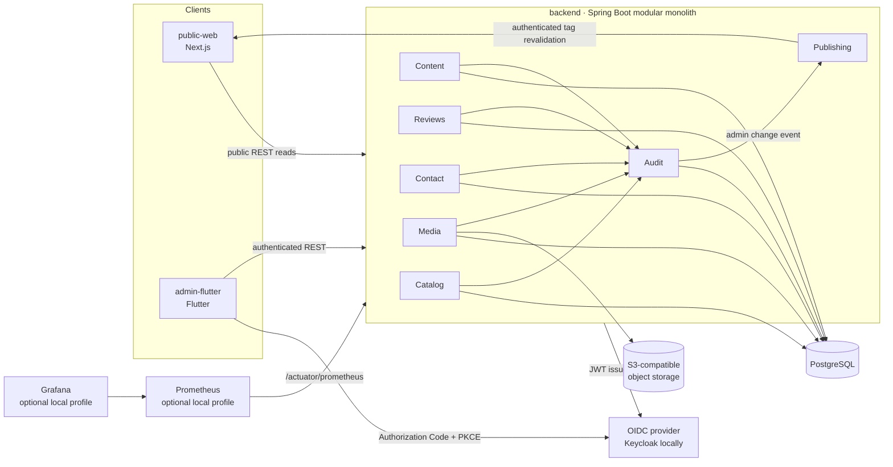

# Container view

The audit module is a durable application change log, not a replacement for centralized security/platform logs. Publishing is deliberately best-effort after commit so public cache freshness does not become part of the business transaction.
