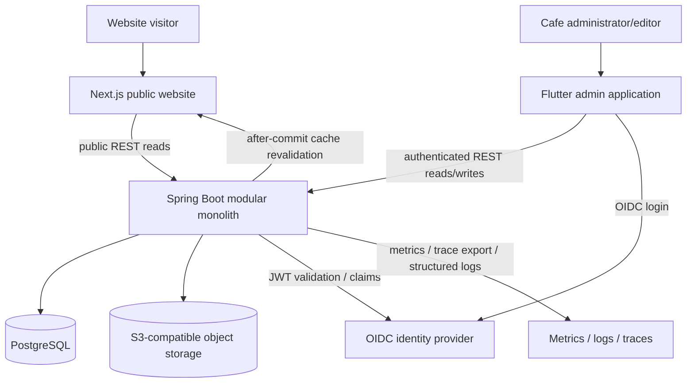

# System context

PostgreSQL stores structured business and append-only audit data. S3-compatible storage backs media binaries. OIDC supplies administrator identity and roles. The public Next.js application is data-cache tagged so committed administrator changes can trigger targeted revalidation while retaining a bounded TTL fallback.

Provider-specific production deployment, telemetry destinations and backup retention remain tracked in `implementation-status.md`.
