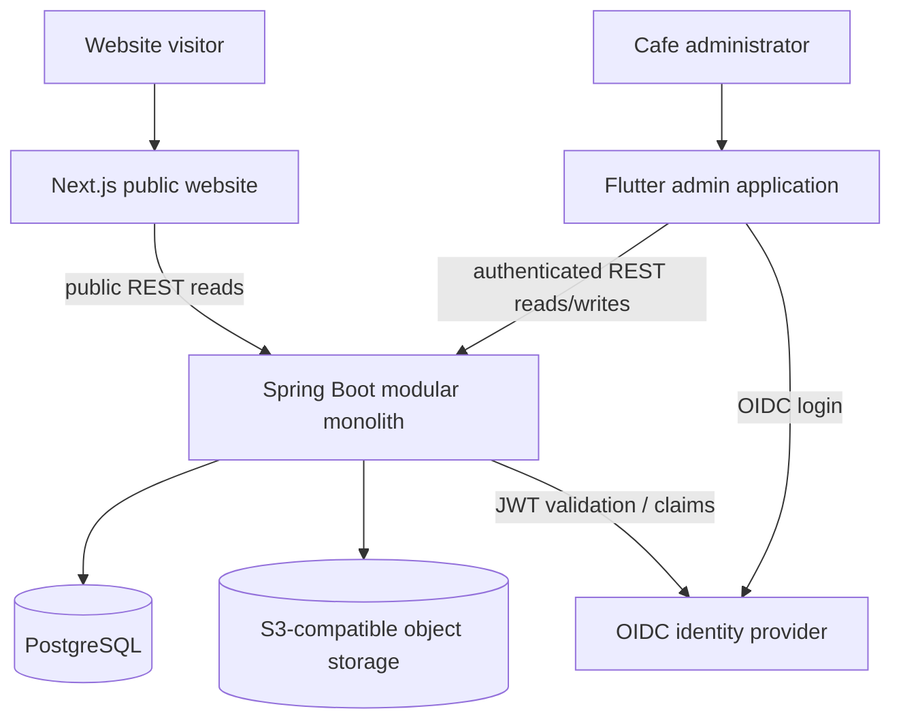

# System context

The implemented platform supports public REST reads from Next.js and authenticated administrator reads/writes from Flutter. PostgreSQL stores structured business data, S3-compatible storage backs the media read path, and OIDC provides administrator identity. Remaining production-readiness work is tracked in `implementation-status.md`.
